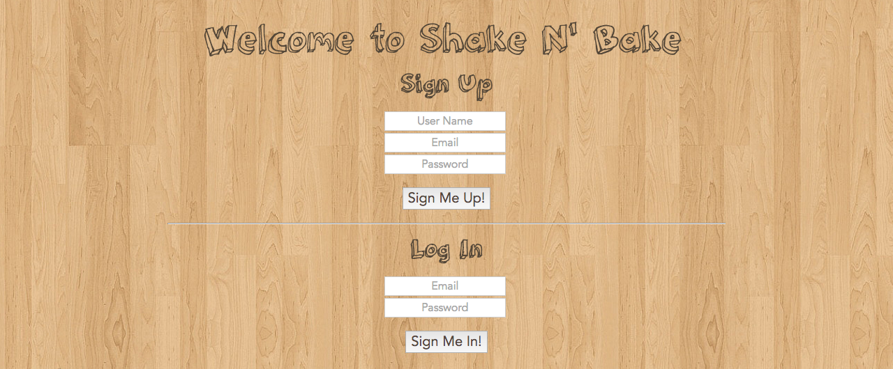
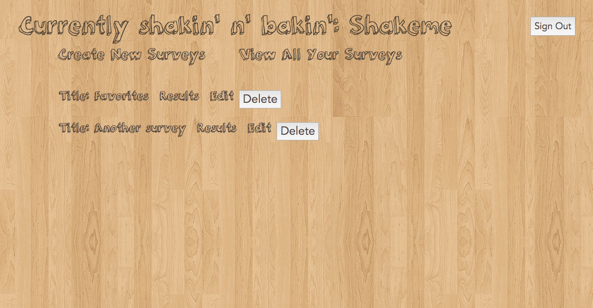
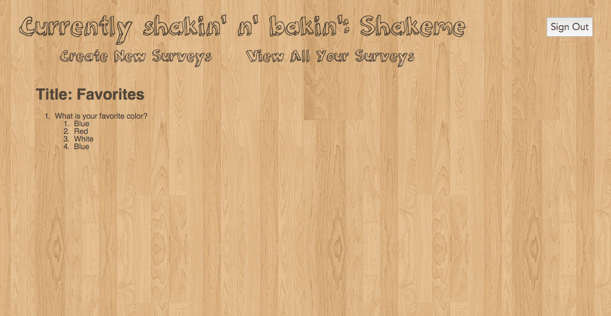

# [Shake-n-Bake](http://shake-n-bake.herokuapp.com/)
##### A Survey Monkey clone

This is the landing page of the app. All surveys that have been created by other users can be seen on the bottom of the page. Users can either sign up, log in, or take a survey if they wish.

After sign up or login, users are directed toward their profile page detailing all the surveys they have created. They now have the option to go into them to edit or delete surveys, as well as the questions themselves. Outside of that, users are free to create more surveys to their liking.

To take a survey, all someone needs to do is log out and go to the landing page in the beginning and fill out the answers. The survey creator would be able to see the tallies from each question of all surveys they created like so:

Thank you all and hope you enjoy this app.

Here is the link: [http://shake-n-bake.herokuapp.com/](http://shake-n-bake.herokuapp.com/)

